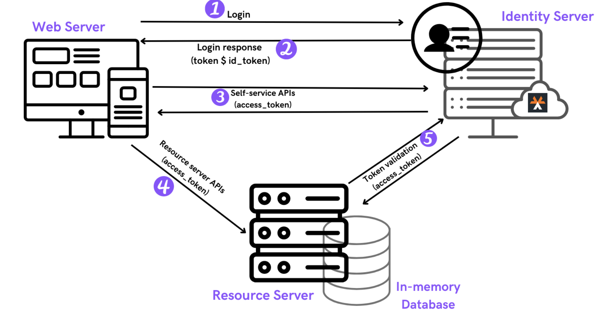

# KFone store

This kfone has two components:
1. kfone-app: Front facing application : [https://kfone-app.fly.dev/](https://kfone-app.fly.dev/)
2. kfone-backend: Server that has APIs required by the front facing application : [https://spring-resource-server.fly.dev/](https://spring-resource-server.fly.dev/)

Both kfone-app and kfone-backend are spring-boot applications.

## Solution Architecture

## Kfone app
kfone-app is a web application, and it uses the following technologies:
1. Spring Boot and java
2. spring-security
3. spring-boot-starter-oauth2-client
4. embedded-tomcat
Refer: [kfone-app/README.md](app/README.md) for more details.

## Kfone backend
To see how to run the backend app , and it uses the following technologies:
1. Spring Boot and java
2. spring-boot-starter-oauth2-resource-server
Refer: [kfone-backend/README.md](backend/README.md) for more details.  

# Getting Started
1. Clone the repository.
   ` git clone https://github.com/piraveena/kfone-store.git`
2. To see how to run the app, refer: [kfone-app/README.md](app/README.md)
3. To see how to run the backend server refer: [kfone-backend/README.md](backend/README.md)

# License
Licenses this source under the Apache License, Version 2.0 [LICENSE](LICENSE), You may not use this file except in compliance with the License.